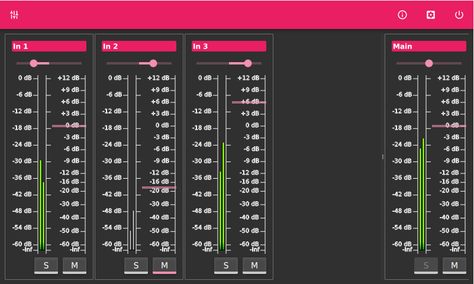

# PieJam
PieJam is a very, very, very simple audio mixer. You can configure the inputs and outputs
of your sound card. The inputs are mixed together and redirected to each configured output.
You can apply a gain on each channel. Mono channels can be panned into stereo.
The user interface was designed to perfectly fit the 7" Raspberry Pi
touchscreen. The initial idea was to run it as a standalone application on a Raspberry Pi
with an attached USB audio interface. But it can also be executed on any other Linux platform.

See accompanying [PieJam OS](https://github.com/nooploop/piejam_os) repository
on how to create a Linux image for the Raspberry Pi.

#### Usage example

#### Audio device settings page

#### Audio input settings page

#### Audio output settings page

#### Mixer page

## ChangeLog
* v0.3.0 - Mute and solo. Modular audio engine.
* [v0.2.0 - In/out configuration. Panning and balance.](doc/release_v0.2.0.md)
* [v0.1.0 - Initial release. Basic mixer.](doc/release_v0.1.0.md)