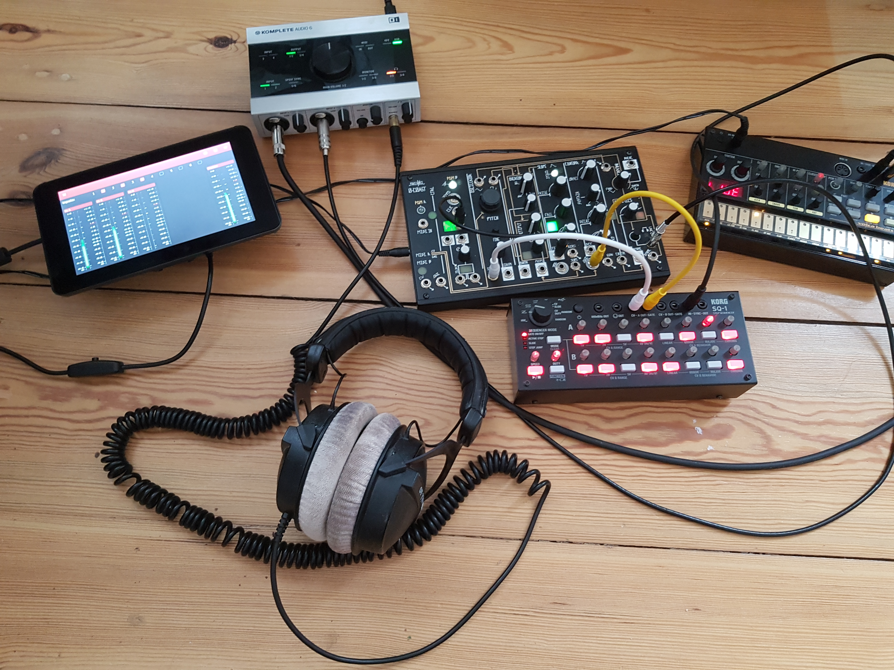

# PieJam
PieJam is a simple audio mixer. The user interface was designed to perfectly fit the 7" Raspberry Pi
touchscreen. The initial idea was to run it as a standalone application on a Raspberry Pi
with an attached USB audio interface. But it can also be executed on any other Linux platform.

See accompanying [PieJam OS](https://github.com/nooploop/piejam_os) repository
on how to create a Linux image for the Raspberry Pi.

## Features
* Dynamic configuration of inputs and outputs
* Panning, stereo balance and volume controls
* Mute and solo
* Fx chain per mixer bus
* Support for LADSPA plugins

#### Usage example

## ChangeLog
* v0.4.0 - Fx chain and LADSPA fx plugins support.
* v0.3.0 - Mute and solo. Modular audio engine.
* v0.2.0 - In/out configuration. Panning and balance.
* v0.1.0 - Initial release. Basic mixer.